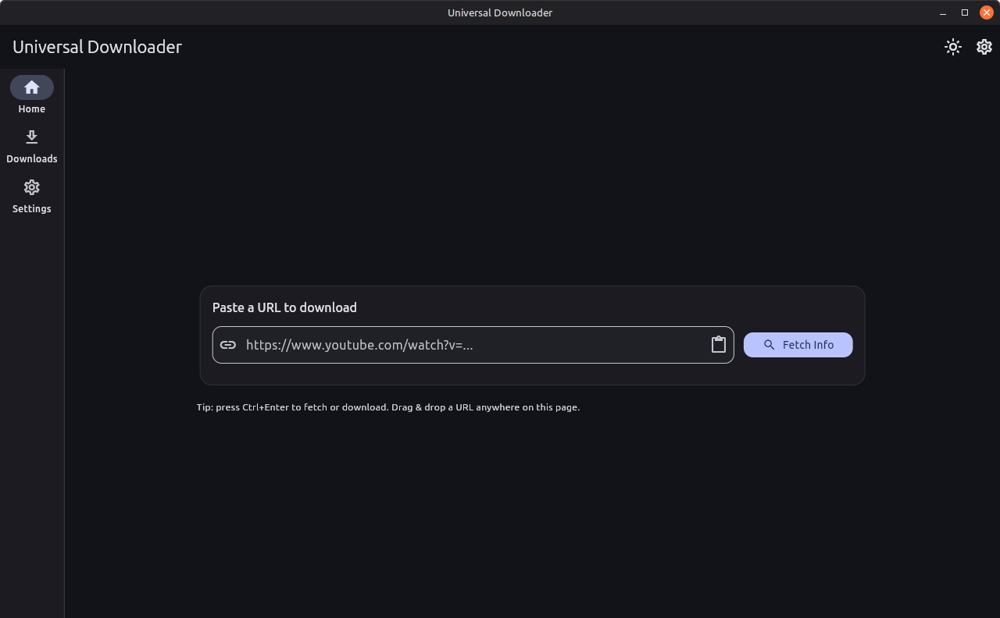
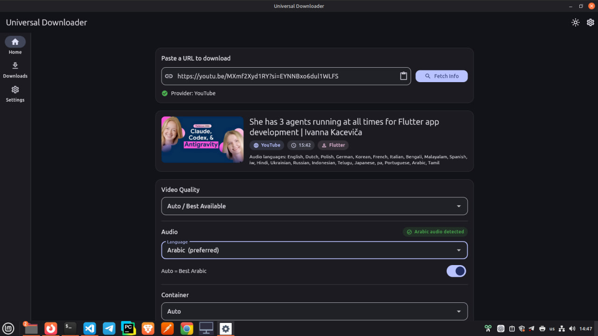
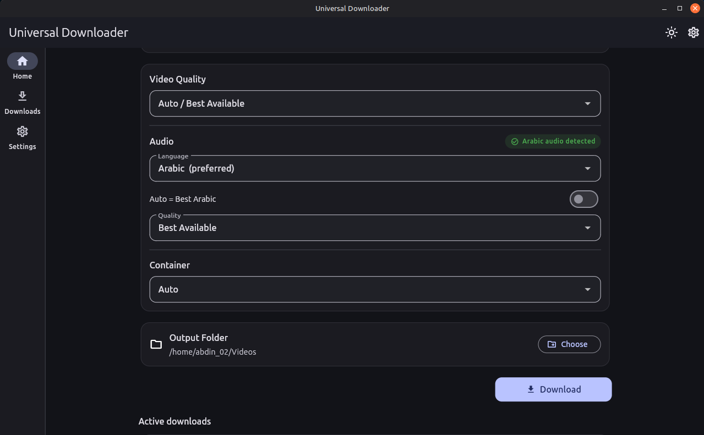
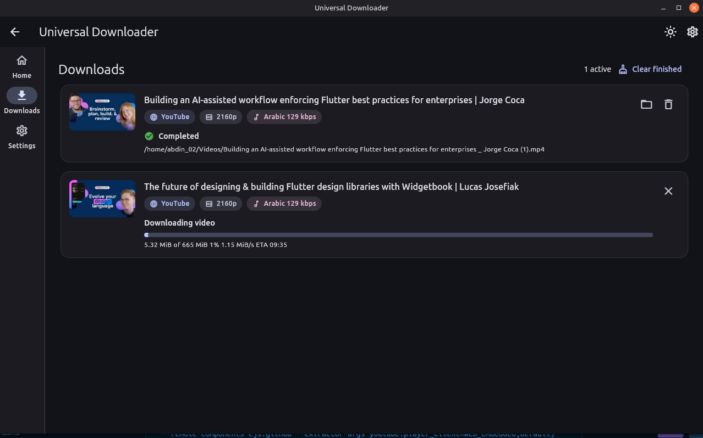
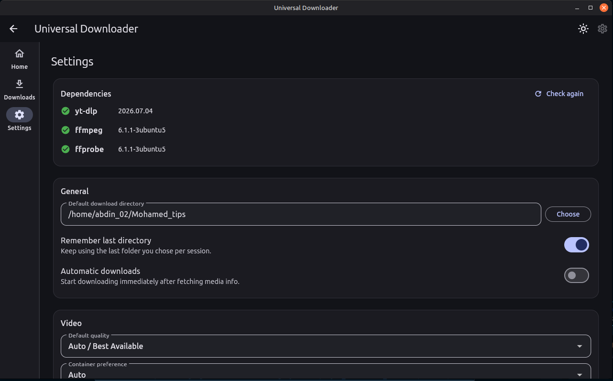

# Universal Downloader

A generic media downloader for Linux desktop, built with Flutter (Material 3).

Paste a URL and the app detects the provider, lists the real available
formats, and downloads the best video stream plus your preferred audio track
(e.g. Arabic) merged into a single file — powered by `yt-dlp` and `ffmpeg`.

## Features

- Provider-agnostic architecture: YouTube today, more providers (Facebook,
  Instagram, TikTok, X/Twitter, Reddit, Vimeo) and direct media URLs planned.
- Per-language audio selection (e.g. prefer Arabic, fall back to English).
- Best video quality selection with a configurable cap (2160p → 360p).
- MP4/MKV container decision based on the actual codecs (stream copy, no
  re-encoding).
- Merged output verified with `ffprobe` (streams present, language matches,
  resolution within the requested cap).
- Queue with concurrency limit, per-task progress, retry and cancellation.
- Missing-dependency banner with install instructions.
- App settings persisted with `shared_preferences`.

## Requirements

- Linux with a GTK desktop environment
- [yt-dlp](https://github.com/yt-dlp/yt-dlp#installation)
  (e.g. `pipx install yt-dlp`)
- [ffmpeg / ffprobe](https://ffmpeg.org/) (e.g. `sudo apt install ffmpeg`)
- Flutter SDK 3.x to build from source

## Build

```sh
flutter pub get
flutter build linux --release
```

The bundle is written to `build/linux/x64/release/bundle/`. Run it with:

```sh
./build/linux/x64/release/bundle/universal_downloader
```

## How to Use

Open the Linux application with the bundle command above. To run it directly
from the source project during development, use:

```sh
flutter run -d linux
```

### 1. Paste a Video Link

On **Home**, paste a YouTube video link into the URL field. The clipboard button
can paste a link you have already copied. Click **Fetch Info** and wait for the
video's details and available formats to appear.



### 2. Review the Video Details

Check the video's title, duration, and available audio languages. Choose
**Video Quality**, then review the **Audio** language. Select Arabic when it is
available, or choose another listed language. Available tracks depend on the
video; check the selected language before downloading.



### 3. Choose Download Options

Keep automatic audio selection enabled to use the best track in the selected
language, or turn it off to choose an audio quality. Choose a **Container**
(Auto, MP4, or MKV), then use **Choose** under **Output Folder** to select where
the file will be saved. Click **Download** to start.



### 4. Monitor Your Downloads

The app opens **Downloads**, where each task shows its progress through
downloading, merging when needed, and verification. When a task shows
**Completed**, click its folder icon (**Open location**) to find the saved file.
Active tasks have a **Cancel** button; failed tasks provide **View details** and
**Retry**. Use **Clear finished** to remove finished entries from the list.



### 5. Configure Settings

In **Settings**, configure the default folder, video quality, and preferred
audio language (`ar` for Arabic or `en` for English). Keep **Automatic downloads**
off when you want to review the formats before each download.



If a missing-dependency banner appears, install `yt-dlp`, `ffmpeg`, and `ffprobe`
as described in Requirements. For tools installed outside your `PATH`, enter
their executable paths in **Settings**, then click **Check again**.

## Test

```sh
flutter analyze
flutter test
```

Integration tests run only when `yt-dlp`/`ffmpeg`/`ffprobe` are on `PATH` and
skip otherwise. The network test hits a well-known public video.

## Where files live

- App data, logs and temporary download artifacts:
  `~/.local/share/universal_downloader/`
- Debug log: `~/.local/share/universal_downloader/logs/universal_downloader.log`

## Architecture

```
lib/
├── app/              app shell, composition root, theme, routes
├── core/
│   ├── errors/       typed exceptions
│   ├── models/       MediaInfo, VideoFormat, AudioFormat, DownloadOptions
│   ├── process/      ProcessRunner (argv based, no shell), CancelToken, progress parser
│   ├── services/     DependencyChecker, LogService, MediaAssembler (merge + verify)
│   └── utils/        filename sanitization, path helpers, format helpers
├── providers/        provider interface + registry + format selection
│   ├── youtube/      YouTube provider, yt-dlp extractor, JSON → models mapper
│   └── direct/       direct media URL provider
├── downloads/        task queue, state machine, repository (temp/output naming)
├── settings/         app settings + persistence
└── ui/               pages and widgets (home, downloads, settings)
```

Download steps for a two-stream (video-only + audio-only) YouTube task:

1. Download the selected video stream to `temp/download_task_<id>/video.tmp`.
2. Download the selected audio stream to `audio.tmp`.
3. Merge both with ffmpeg stream copy (`-c:v copy -c:a copy -shortest`).
4. Verify the final file with ffprobe.
5. Clean up temp files only after successful verification.

On failure the temp files are intentionally kept so the user can retry without
re-downloading. Cancellation uses cooperative tokens: SIGTERM, then SIGKILL
after a short grace period.
