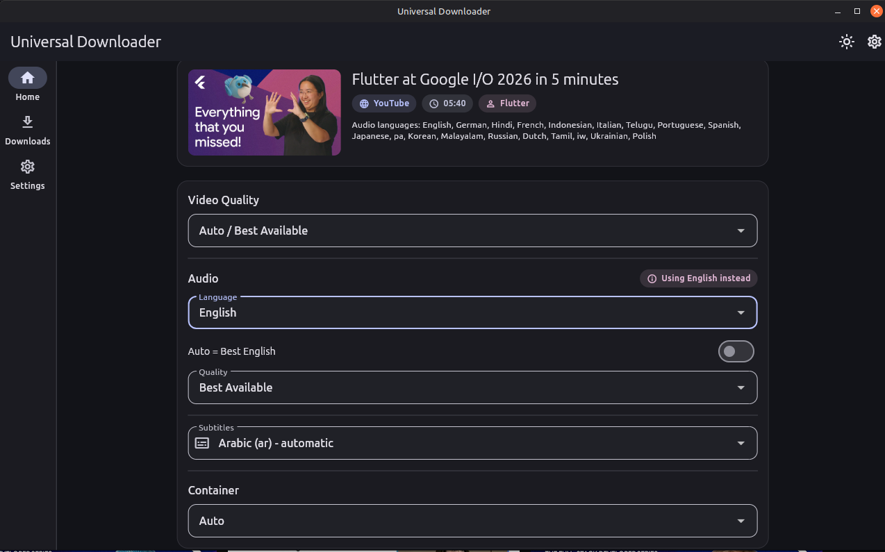
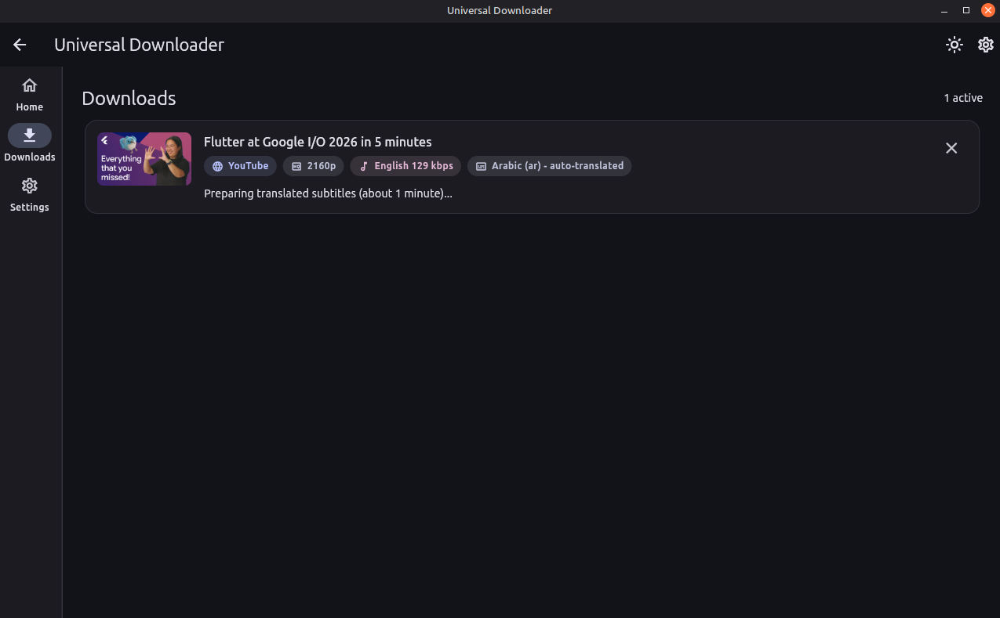
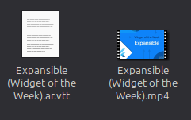

# Universal Downloader

A Flutter (Material 3) media downloader for Linux desktop and an Android preview.

Paste a URL and the app detects the provider, lists the real available
formats, and downloads the best video stream plus your preferred audio track
(e.g. Arabic) merged into a single file — powered by `yt-dlp` and `ffmpeg`.

## Features

- Provider-agnostic architecture: YouTube today, more providers (Facebook,
  Instagram, TikTok, X/Twitter, Reddit, Vimeo) and direct media URLs planned.
- Per-language audio selection (e.g. prefer Arabic, fall back to English).
- Best video quality selection with a configurable cap (2160p → 360p).
- MP4/MKV container decision based on the actual codecs (stream copy, no
  re-encoding).
- Merged output verified with `ffprobe` (streams present, language matches,
  resolution within the requested cap).
- Queue with concurrency limit, per-task progress, retry and cancellation.
- Included media tools with verified updates and recovery in Advanced settings.
- App settings persisted with `shared_preferences`.

## Requirements

- Linux x86_64 with a GTK 3 desktop environment and EGL graphics libraries;
  tested on Ubuntu 24.04.
- The packaged app includes yt-dlp, FFmpeg, FFprobe, and Deno. No separate media
  tool or Python installation is required.
- Building from source requires Flutter with Dart 3.12.2 or newer, the Flutter
  Linux build prerequisites, Python 3.11 or newer, and internet access for the
  first tool download. Python is used only during packaging.

Extract `universal-downloader-linux-x64.tar.gz` and run
`universal-downloader/universal_downloader`. Keep the complete extracted folder
together, including `lib/`, `data/`, and `tools/`.

## Build

```sh
flutter pub get
python3 tool/build_linux.py
```

This downloads pinned tools, verifies their checksums, and creates the app
archive and tool update assets in `dist/`. The unpacked bundle is written to
`build/linux/x64/release/bundle/`. Run it with:

```sh
./build/linux/x64/release/bundle/universal_downloader
```

See [packaging and update instructions](tool/README.md) for version pins,
clean-environment checks, release assets, and redistribution requirements.

## Android Preview

Android 10 (API 29) or newer is required. The APK includes yt-dlp, Python,
QuickJS, FFmpeg, and FFprobe. Users install only the APK; tools and JavaScript
solver files are unpacked from the app without downloading runtimes on the
phone. Tools update with a new APK, and desktop executable overrides are hidden.

```sh
flutter build apk --release --split-per-abi --target-platform android-arm64,android-x64
```

The ARM64 phone APK is `build/app/outputs/flutter-apk/app-arm64-v8a-release.apk`;
the x86_64 emulator APK is beside it. These preview builds use the template's
debug signing key. The first developer build downloads Maven dependencies and
pinned yt-dlp, verifies the extractor SHA-256 from `tool/android_tools.json`, and
embeds it as an Android resource. A normal rebuild can reuse the build cache.

For one APK containing all targeted architectures, run `flutter build apk
--release`; the output is `build/app/outputs/flutter-apk/app-release.apk`.
Release validation must include first startup on a clean app installation,
as well as an upgrade: an existing unpacked runtime can hide extraction bugs.
The app's ProGuard rules preserve the ZIP extra-field constructors that Apache
Commons Compress invokes reflectively while unpacking the included tools.

Downloads and merges use app-private storage. Verified video and subtitle files
are published through MediaStore into a new folder under
`Downloads/UniversalDownloader`, preserving matching video/subtitle basenames.
The Open video action delegates to an installed video player. No broad storage
permission is required. Small screens use bottom navigation.

Keep the app open while downloading in this preview. Foreground notifications,
recovery after process death, sharing, and persistent queue history are not yet
implemented. Release startup was verified on a Realme C53 with Android 14;
full runtime/merge/publication tests used an Android 13 x86_64 emulator.
Full ARM64 download testing and 16 KB page-size validation remain release checks.

To run the native tool/merge/publication/cancellation smoke test on an emulator:

```sh
flutter run -d emulator-5554 -t tool/android_smoke.dart
flutter run -d emulator-5554 -t tool/android_smoke.dart --dart-define=ANDROID_LIVE_TEST=true
```

The second command also extracts multilingual YouTube metadata and downloads a
short live video. Results are logged with `ANDROID_SMOKE_RESULT` and saved under
the app's private `files/universal_downloader/smoke-result.json`. This is a test
entrypoint; normal APK builds use `lib/main.dart`.

## How to Use

Open the Linux application with the bundle command above. To run it directly
from the source project during development, use:

```sh
flutter run -d linux
```

### 1. Paste a Video Link

On **Home**, paste a YouTube video link into the URL field. The clipboard button
can paste a link you have already copied. Click **Fetch Info** and wait for the
video's details and available formats to appear.


### 2. Review the Video Details

Check the video's title, duration, and available audio languages. Choose
**Video Quality**, then review the **Audio** language. Select Arabic when it is
available, or choose another listed language. Available tracks depend on the
video; check the selected language before downloading.


### 3. Choose Download Options

Keep automatic audio selection enabled to use the best track in the selected
language, or turn it off to choose an audio quality. Choose a **Container**
(Auto, MP4, or MKV), then use **Choose** under **Output Folder** to select where
the file will be saved. Click **Download** to start.

**Subtitles** defaults to **None** each time you fetch a video. To include
captions, choose one of the available tracks and turn on **Add separate subtitle
file** before downloading. The toggle defaults to off and resets on each fetch.
Turning it off keeps the selected language but downloads no subtitle file.
It is disabled while **None** is selected. Automatic
captions are labeled **automatic** or **auto-translated**; subtitle language is
independent of audio language. Videos without supported subtitle tracks keep
this field disabled.



Auto-translated captions wait about one minute before downloading to allow
YouTube's caption session to become ready. The task shows **Preparing translated
subtitles** and remains cancellable. This addresses the
[known yt-dlp/YouTube HTTP 429 issue](https://github.com/yt-dlp/yt-dlp/issues/13831).
If YouTube still returns HTTP 429, wait a few minutes before retrying.



With **Add separate subtitle file** on, selected captions are saved beside the
video as a separate `.vtt` file (`.srt`
when VTT is unavailable), using the same filename plus the language code, such
as `Video.ar.vtt`. They are not burned into or embedded in the video. A selected
subtitle download failure fails the task; turn off **Add separate subtitle file**
or select **None** and start a new task
to download without captions. Keep **Automatic downloads** off to choose a
subtitle track before starting. Caption downloads use
[yt-dlp's subtitle options](https://github.com/yt-dlp/yt-dlp#subtitle-options).


### 4. Monitor Your Downloads

The app opens **Downloads**, where each task shows its progress through
downloading, merging when needed, and verification. When a task shows
**Completed**, click its folder icon (**Open location**) to open the containing
folder with the saved video selected. If the file manager does not support
selection, the app opens the folder instead.
Active tasks have a **Cancel** button; failed tasks provide **View details** and
**Retry**. Use **Clear finished** to remove finished entries from the list.


New YouTube downloads automatically include the original YouTube cover image
inside the saved MP4 or MKV when the video metadata provides one. Video and
audio are copied without re-encoding. Combined WebM downloads use MKV to support
the attachment. A cover download or embedding failure fails the task so it can
be retried. Existing downloads are not modified.



MP4 uses FFmpeg's [embedded cover support](https://ffmpeg.org/ffmpeg.html#Main-options);
MKV stores a JPEG attachment. File managers and players may still choose a video
frame for previews. On Linux, `ffmpegthumbnailer` needs its `-m` option to prefer
embedded artwork; existing cached previews may need refreshing.
After changing a thumbnailer definition, restart Nemo so it loads the new
command. Refreshing the folder alone may keep using the previous command.

### 5. Configure Settings

In **Settings**, configure the default folder, video quality, and preferred
audio language (`ar` for Arabic or `en` for English). Keep **Automatic downloads**
off when you want to review the formats before each download.

Tool versions and paths are under **Settings → Advanced → Diagnostics**.
**Update tools** checks this project's published releases and verifies the
download before activating it. Failed updates keep the current tools.
**Use included tools** restores the tools shipped with the app and clears custom
executable overrides. Finish or cancel queued downloads before changing tools.

If a component is unavailable, use Diagnostics to restore the included tools
or extract the complete app package again. Advanced settings still allow custom
yt-dlp, FFmpeg, and FFprobe paths. Source builds without a prepared bundle can
use tools on `PATH`; release builds require the included runtime.

## Test

```sh
flutter analyze
flutter test
```

Integration tests run only when `yt-dlp`/`ffmpeg`/`ffprobe` are on `PATH` and
skip otherwise. The network test hits a well-known public video.

## Where files live

- App data, logs and temporary download artifacts:
  `~/.local/share/universal_downloader/`
- Debug log: `~/.local/share/universal_downloader/logs/universal_downloader.log`

## Architecture

```
lib/
├── app/              app shell, composition root, theme, routes
├── core/
│   ├── errors/       typed exceptions
│   ├── models/       MediaInfo, VideoFormat, AudioFormat, DownloadOptions
│   ├── process/      CommandRunner contract, ProcessRunner, cancellation, progress parser
│   ├── services/     DependencyChecker, LogService, MediaAssembler (merge + verify)
│   ├── tools/        bundled paths, verified update installation, release checks
│   └── utils/        filename sanitization, path helpers, format helpers
├── platform/         OS detection + DownloadPlatform contract
│   ├── linux/        Linux tools, paths, updates, publication, file opening
│   └── android/      native command bridge, private paths, MediaStore publication
├── providers/        provider contracts + factories + registry + format selection
│   ├── factories/    construct providers using the selected platform services
│   ├── youtube/      YouTube provider, yt-dlp extractor, JSON → models mapper
│   └── direct/       direct media URL provider
├── downloads/        task queue, state machine, repository (temp/output naming)
├── settings/         app settings + persistence
└── ui/               pages and widgets (home, downloads, settings)
```

Operating-system services and website providers vary independently. At startup,
`DownloadPlatformFactory` detects the OS and supplies a `DownloadPlatform`.
`AppController` passes its command runner, directories, and resolved tools to
provider factories through `ProviderDependencies`. The controller and queue
work with `DownloaderProvider`; they do not select concrete website classes.

To add a website, implement `DownloaderProvider` in `lib/providers/<site>/`,
implement its `ProviderFactory`, and register the factory in
`default_provider_factories.dart`. Tool-based providers can implement
`ToolConfigurableProvider` to receive updated executable paths and arguments.
Use a stable, unique provider ID; registration order determines URL precedence.
Factories can supply a different implementation where a platform requires one,
while shared provider logic continues to use `CommandRunner`.

To add an OS, implement `DownloadPlatform` in `lib/platform/<os>/` and register
it in `DownloadPlatformFactory`. That implementation owns command execution,
paths, tool checks/updates, final publication, and opening completed downloads.
The queue waits for publication before marking a task complete; the returned
location can be a filesystem path or a content URI. A publisher must honor its
cancellation token before committing a file and clean up partial publication
on failure. Linux publication returns the provider's already verified file.

Linux and the Android preview implement this contract. The Android factory
initializes bundled native tools asynchronously before constructing providers.
Completed results carry subtitle sidecar files so Android publishes the entire
selected output. Other operating systems remain unsupported, and the existing
Facebook/Instagram/TikTok/X classes remain unregistered stubs.

Download steps for a two-stream (video-only + audio-only) YouTube task:

1. Download the original cover, when available, and selected subtitles into the
   task's temporary directory.
2. Download the selected video stream to `temp/download_task_<id>/video.tmp`.
3. Download the selected audio stream to `audio.tmp`.
4. Merge both with ffmpeg stream copy and embed the cover. Cover-enabled merges
   omit `-shortest` to prevent the still image from truncating the video.
   Merges write into a hidden staging directory in the output folder, then
   atomically rename the finished file so thumbnailers never see partial output.
5. Verify the media streams and expected cover with ffprobe, then copy any
   selected subtitles beside the video.
6. Clean up temp files only after successful verification and subtitle saving.

On failure the temp files are intentionally kept so the user can retry without
re-downloading. Cancellation uses cooperative tokens: SIGTERM, then SIGKILL
after a short grace period.
